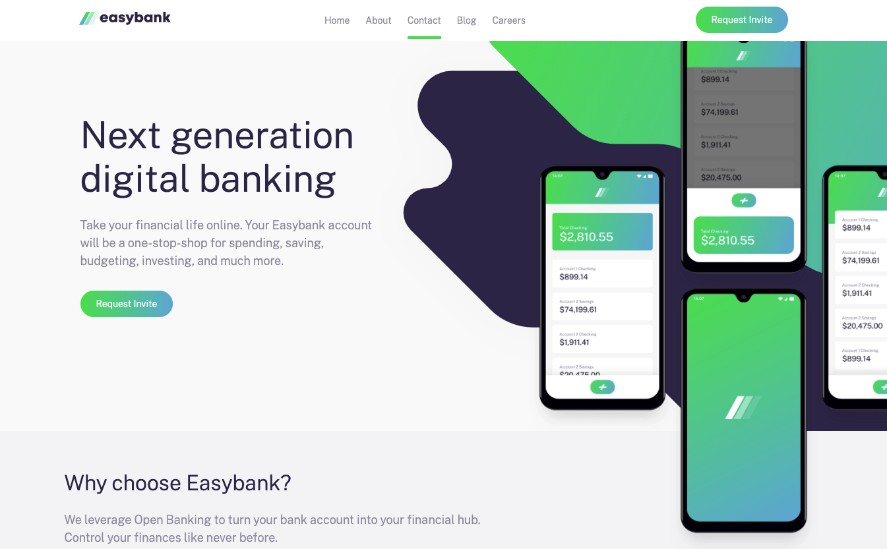

# Frontend Mentor - Easybank landing page solution

This is my solution to the [Easybank landing page challenge on Frontend Mentor](https://www.frontendmentor.io/challenges/easybank-landing-page-WaUhkoDN). 

## Table of contents

- [Frontend Mentor - Easybank landing page solution](#frontend-mentor---easybank-landing-page-solution)
  - [Table of contents](#table-of-contents)
  - [Overview](#overview)
    - [The challenge](#the-challenge)
    - [Screenshot](#screenshot)
    - [Links](#links)
  - [My process](#my-process)
    - [Built with](#built-with)
    - [What I learned](#what-i-learned)
    - [Continued development](#continued-development)
  - [Author](#author)
  
## Overview

### The challenge

Users should be able to:

- View the optimal layout for the site depending on their device's screen size
- See hover states for all interactive elements on the page

### Screenshot

### Links

- Solution URL: [URL here](https://www.frontendmentor.io/solutions/html-css-flexbox-and-css-grid-javascript-nfSzrc34F)
- Live Site URL: [URL here](https://easybank-sergiobarria.netlify.app/)

## My process

### Built with

- Semantic HTML5 markup
- CSS custom properties
- Flexbox
- CSS Grid
- Mobile-first workflow

### What I learned

This project is designed to help you put on practice some of the core concepts of CSS like Flexbox or CSS Grid. My first approach to this project was to use a Desktop-first workflow, however, after some evaluation of the project and I decided Mobile-first was the best choice.

### Continued development

After finishing this project, I want to keep practicing images positioning. I think this is a core concept of modern web development.

## Author

- Website - [Sergio Barria](https://www.sergiobarria.com)
- Frontend Mentor - [@sergiobarria](https://www.frontendmentor.io/profile/sergiobarria)
- Twitter - [@sergioBarria01](https://www.twitter.com/sergioBarria01)

